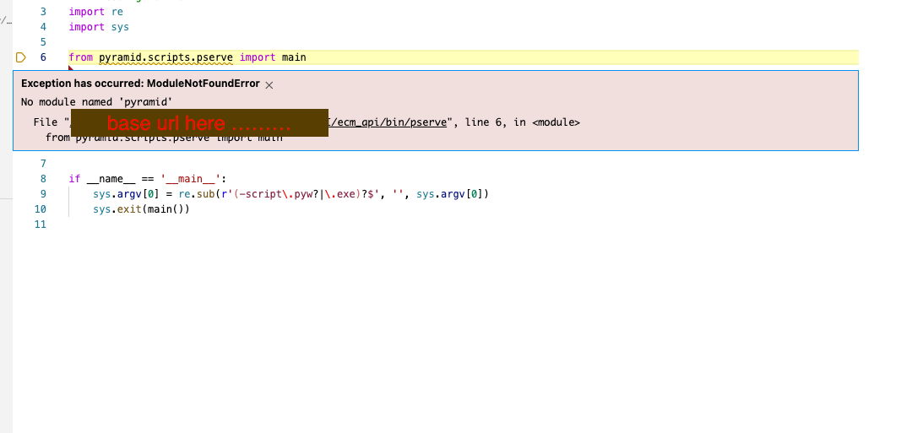

# How to solve debugging issue for pyramid application with below listed configuration ? #

```js

1. launch.json

{
    // Use IntelliSense to learn about possible attributes.
    // Hover to view descriptions of existing attributes.
    // For more information, visit: https://go.microsoft.com/fwlink/?linkid=830387
    "version": "0.2.0",
    "configurations": [
        {
            "name": "Pyramid",
            "type": "python",
            "request": "launch",
            "program": "${workspaceFolder}/virtual_environment_name_here/bin/pserve",
            "args": [
                "${workspaceFolder}/development.ini",
            ],
            "debugOptions": [
                "RedirectOutput",
            ]
        },
        {
            "name": "Python: Current File (Integrated Terminal)",
            "type": "python",
            "request": "launch",
            "program": "${file}",
            "console": "integratedTerminal"
        },
        {
            "name": "Python: Remote Attach",
            "type": "python",
            "request": "attach",
            "port": 5678,
            "host": "localhost",
            "pathMappings": [
                {
                    "localRoot": "${workspaceFolder}",
                    "remoteRoot": "."
                }
            ]
        }
    ]
}

```

## Error Screen ##


## Solution ##
- Don't activate virtual environment inside Visual Studio while running debugger otherwise above shown Error Screen will appear
- Create Virtual environment then install all the dependencies
- Don't activate virtual environment but locate virtual environment from bottom of the visual studio debugger as shown in image

- Then this issue will be resolved.


