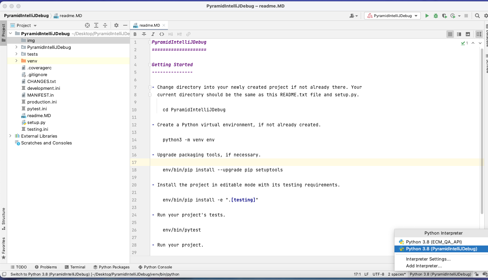
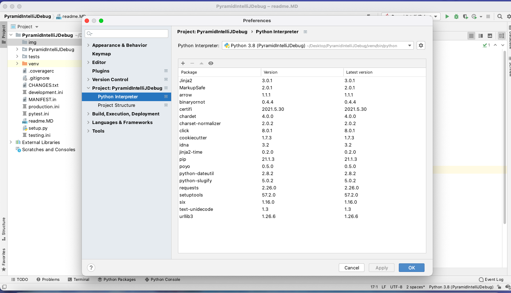
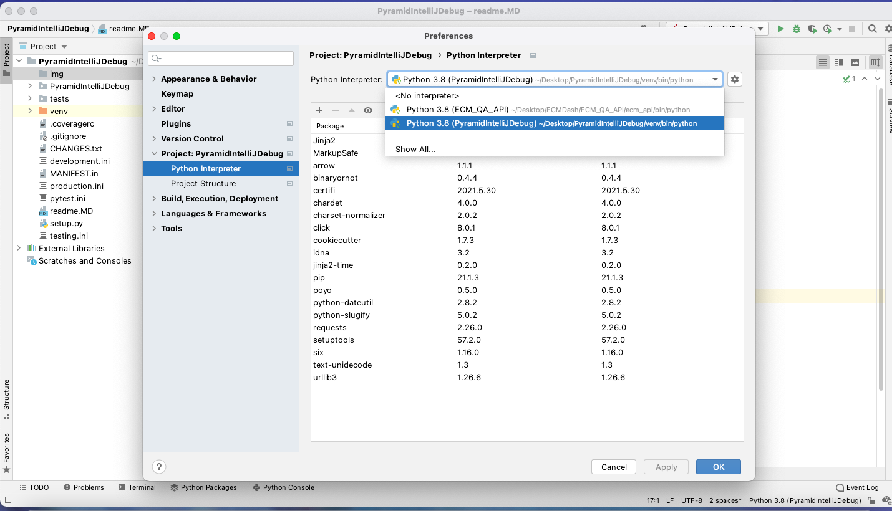

PyramidIntelliJDebug
====================

Getting Started
---------------

- Change directory into your newly created project if not already there. Your
  current directory should be the same as this README.txt file and setup.py.

    cd PyramidIntelliJDebug

- Create a Python virtual environment, if not already created.

    python3 -m venv env

- Upgrade packaging tools, if necessary.

    env/bin/pip install --upgrade pip setuptools

- Install the project in editable mode with its testing requirements.

    env/bin/pip install -e ".[testing]"

- Run your project's tests.

    env/bin/pytest

- Run your project.

    env/bin/pserve development.ini

# Tips for debugging python application in Pyramid #
- Create virtual environment, activate and install all the dependencies
- Don't activate it using command, locate it using PyCharm or Visual Studio IDE interpreter

Note: don't activate virtual environment during debugging, locate virtual environment from IDE virtual
