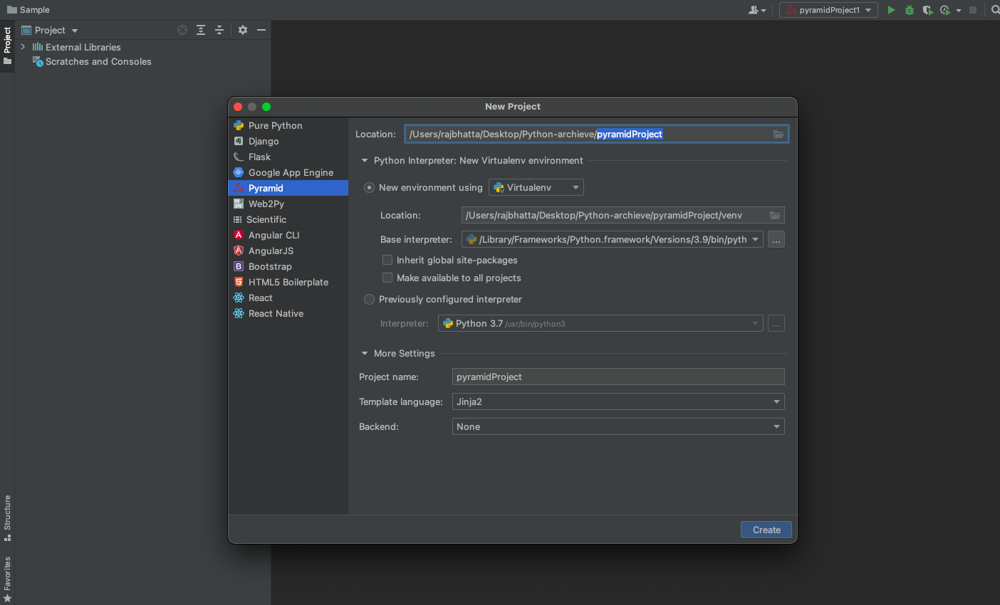
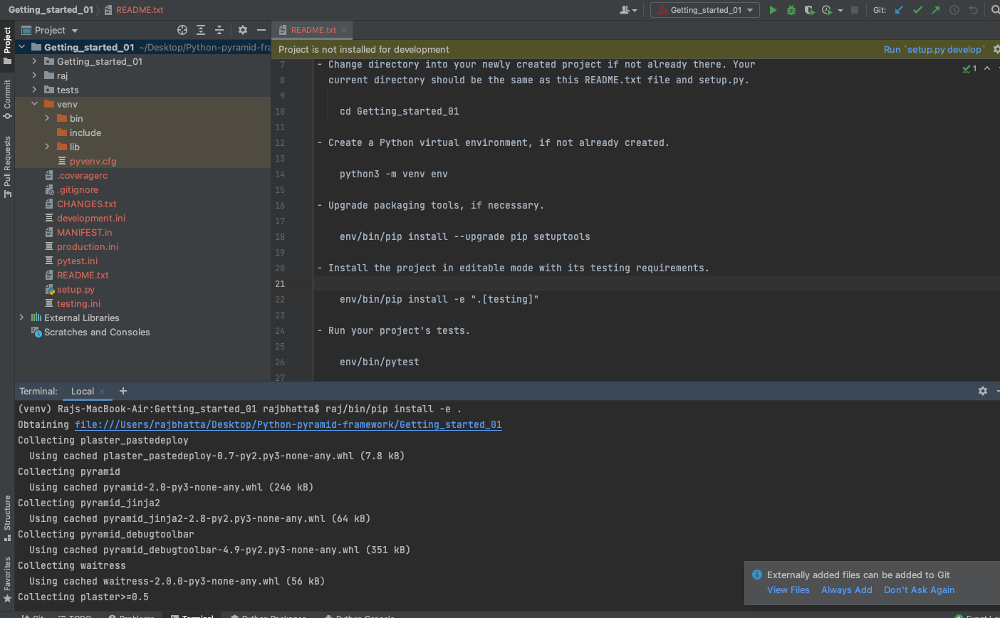

# 1. Creating pyramid Python project #
- Change directory into your newly created project if not already there. Your
  current directory should be the same as this README.txt file and setup.py.

    cd Getting_started_01

- Create a Python virtual environment, if not already created.

    python3 -m venv raj
    

     
    

- Activate created python environment

- Upgrade packaging tools, if necessary.

    raj/bin/pip install --upgrade pip setuptools
     

- Install the project in editable mode with its testing requirements.

    raj/bin/pip install -e ".[testing]"
     

- Run your project's tests.

    raj/bin/pytest

- Run your project.

    raj/bin/pserve development.ini
     
