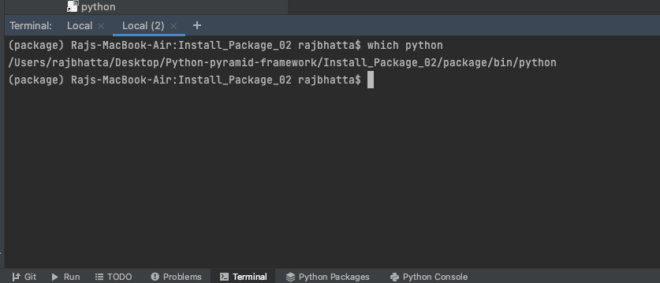
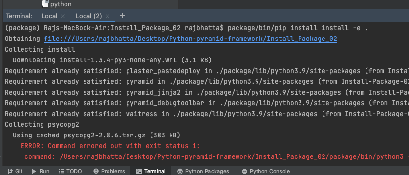

# 1. Output of Pyramid #


# 2. How to install PostGresSQL dependency #
- Locate setup.py inside the project

```python
requires = [
    ...,
    'psycopg2',
    'alembic',
]
```


- Install all the dependencies using pip located inside the virtual environment
```python
package/bin/pip install install -e .
```



Note: we saw that we are having error at this stage during the installation


# How to solve installation issue to run the project? #
